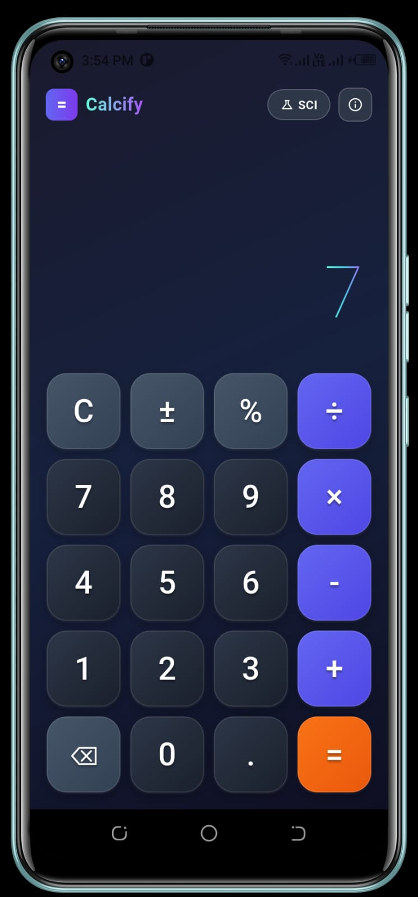
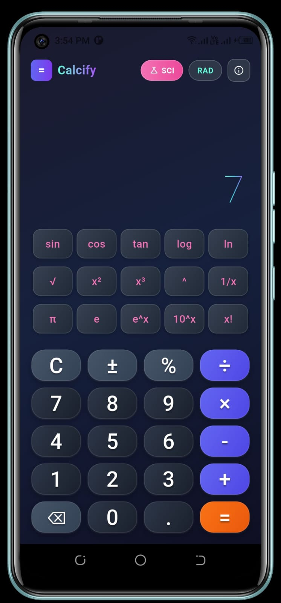
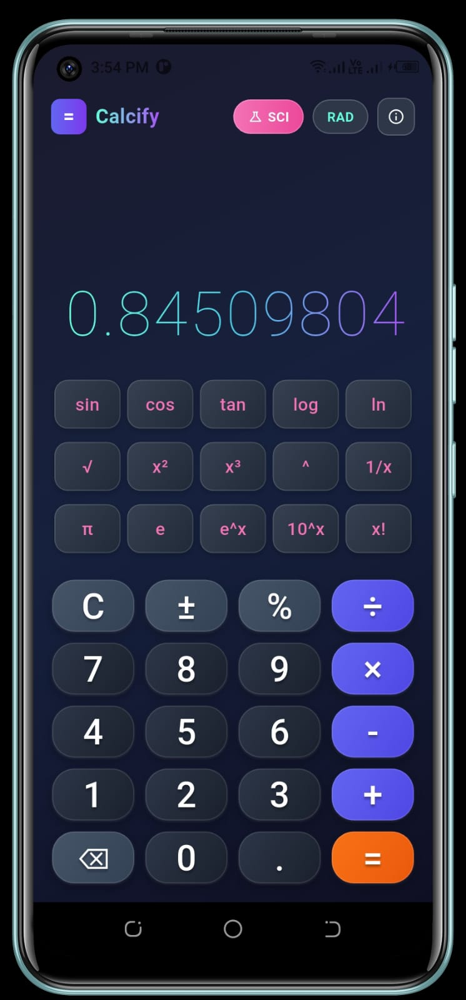
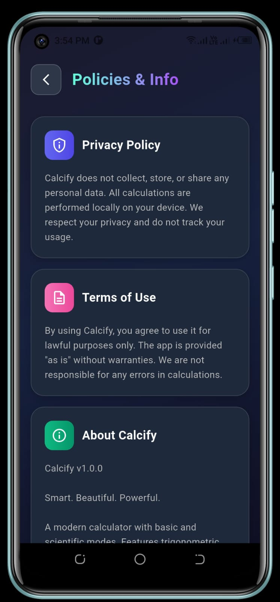

# Calcify

**Smart. Beautiful. Powerful.**

A modern, beautifully designed calculator app built with Flutter. Calcify combines elegant UI with powerful functionality, offering both basic and scientific calculation modes.

## Screenshots

<p align="center">
  
  
  
</p>

<p align="center">
  
  
  
</p>

## Features

### Basic Calculator
- Addition, subtraction, multiplication, division
- Percentage calculations
- Plus/minus toggle
- Decimal support
- Backspace functionality
- Clear function

### Scientific Calculator
- **Trigonometric functions**: sin, cos, tan
- **Logarithmic functions**: log (base 10), ln (natural log)
- **Power functions**: x², x³, x^y, 10^x, e^x
- **Other functions**: Square root (√), factorial (x!), reciprocal (1/x), absolute value (|x|)
- **Constants**: π (pi), e (Euler's number)
- **Angle modes**: Radians (RAD) and Degrees (DEG)

### UI/UX
- Beautiful gradient dark theme
- Animated splash screen with logo
- Smooth button press animations with haptic feedback
- Gradient text display for results
- Responsive design
- Clean and intuitive interface

## Getting Started

### Prerequisites
- Flutter SDK (^3.8.1)
- Dart SDK
- Android Studio / VS Code with Flutter extension

### Installation

1. Clone the repository:
```bash
git clone https://github.com/stackmasteraliza/calcify.git
```

2. Navigate to the project directory:
```bash
cd calcify
```

3. Install dependencies:
```bash
flutter pub get
```

4. Run the app:
```bash
flutter run
```

## Building

### Android
```bash
flutter build apk --release
```

### iOS
```bash
flutter build ios --release
```

## Tech Stack

- **Framework**: Flutter
- **Language**: Dart
- **State Management**: setState (StatefulWidget)
- **Animations**: Built-in Flutter animations

## Project Structure

```
lib/
└── main.dart          # Main application file containing all screens and widgets
    ├── CalculatorApp      # Main app widget
    ├── SplashScreen       # Animated splash screen
    ├── CalculatorScreen   # Main calculator interface
    ├── CalculatorButton   # Custom animated button widget
    └── PoliciesScreen     # Privacy policy and app info
```

## Privacy

Calcify does not collect, store, or share any personal data. All calculations are performed locally on your device. We respect your privacy and do not track your usage.

**[View Full Privacy Policy](https://stackmasteraliza.github.io/calcify/)**

## License

This project is open source and available under the [MIT License](LICENSE).

## Author

Made with Flutter

---

**Version**: 2.0.0
